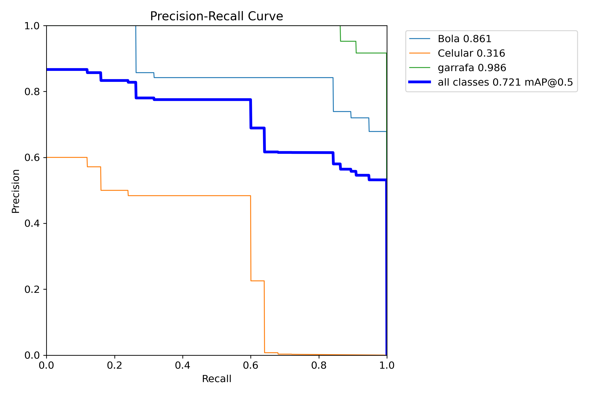
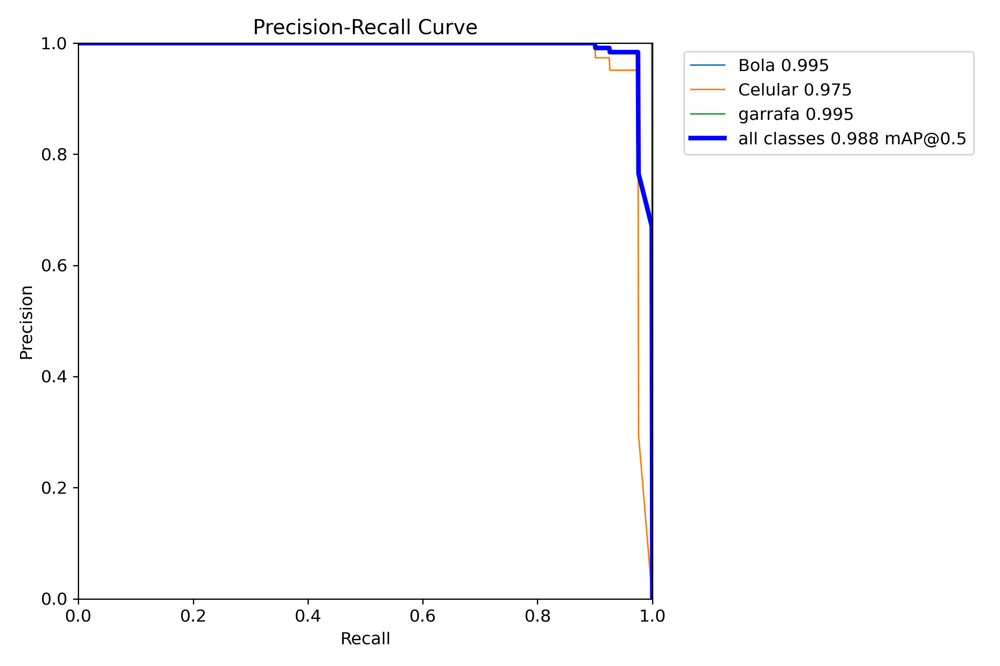

# 🎯 Custom Object Detection with YOLOv8


Projeto de detecção de objetos em tempo real utilizando **YOLOv8 (Ultralytics)** treinado em dataset próprio capturado via webcam.

O objetivo foi:

- Criar dataset personalizado
- Treinar diferentes versões do YOLOv8
- Comparar desempenho entre modelos
- Analisar impacto do aumento de dados
- Realizar inferência em tempo real via webcam

---

## 📦 Objetos Detectados

- Bola  
- Celular  
- Garrafa  

---

## 📂 Dataset

O dataset foi criado e anotado utilizando **Roboflow**.

🔗 Acesse aqui:  
https://universe.roboflow.com/testando-yolo/my-first-project-8szjb/dataset/2

Formato de exportação: **YOLOv8**  
Número de classes: **3**  
Total de imagens do dataset final: **379**  
Split: **70% treino / 20% validação / 10% teste**

---

# 🧠 Metodologia

## 1️⃣ Coleta de Dados

- Captura via webcam  
- ~100 imagens iniciais por classe  
- Posteriormente adicionadas +75 imagens da classe **Celular**  
- Anotação realizada via Roboflow  

---

## 2️⃣ Modelos Treinados

### 🔹 Modelo 1 — YOLOv8n (Nano)

- Dataset inicial (~303 imagens)
- Modelo leve (~3M parâmetros)

Resultados (Validation):

| Classe   | mAP@0.5 |
|----------|----------|
| Bola     | 0.964 |
| Celular  | 0.256 |
| Garrafa  | 0.919 |
| **All**  | **0.713** |

📉 A classe **Celular apresentou baixo desempenho**, indicando necessidade de maior diversidade de dados.

#### PR Curve — YOLOv8n



---

### 🔹 Modelo 2 — YOLOv8s (Small)

- Dataset aumentado (379 imagens)
- Modelo maior (~11M parâmetros)

Resultados (Validation):

| Classe   | mAP@0.5 |
|----------|----------|
| Bola     | 0.995 |
| Celular  | 0.975 |
| Garrafa  | 0.995 |
| **All**  | **0.988** |

📈 O aumento de dados + modelo maior resultou em melhoria significativa na classe Celular.

#### PR Curve — YOLOv8s



---

# 📊 Análise de Resultados

## Comparação Geral

| Modelo  | Dataset            | mAP@0.5 (All) |
|----------|-------------------|---------------|
| YOLOv8n | Dataset inicial   | 0.713 |
| YOLOv8s | Dataset aumentado | 0.988 |

## Principais Insights

- A classe Celular exigiu maior variação de dados.
- Aumento de dataset impactou diretamente Precision e Recall.
- YOLOv8s mostrou maior capacidade de generalização.
- mAP por classe foi essencial para diagnosticar o gargalo.
- Dados foram mais determinantes que apenas trocar o modelo.

---

# ⚙️ Treinamento

Treinamento realizado utilizando GPU (CUDA).

```python
from ultralytics import YOLO

model = YOLO("yolov8s.pt")

model.train(
    data="dataset/data.yaml",
    epochs=50,
    imgsz=640,
    device=0
)
```

---

# 🎥 Inferência em Tempo Real

Teste via webcam:

```python
from ultralytics import YOLO

model = YOLO("runs/detect/trainX/weights/best.pt")
model.predict(source=0, show=True)
```

O modelo detecta múltiplos objetos simultaneamente em tempo real.

---

# 🛠 Tecnologias Utilizadas

- Python  
- YOLOv8 (Ultralytics)  
- PyTorch  
- OpenCV  
- Roboflow  
- GPU (CUDA)  

---

# 📁 Estrutura do Projeto

```
├── train.py
├── test_webcam.py
├── requirements.txt
├── results/
│   ├── pr_curve_nano.png
│   └── pr_curve_small.png
├── .gitignore
└── README.md
```

---

# 🎯 Principais Aprendizados

- Pipeline completo de Object Detection  
- Formato YOLO annotation  
- IoU e Non-Maximum Suppression  
- Precision, Recall e mAP  
- Impacto do tamanho do modelo  
- Impacto do aumento de dataset  
- Comparação entre YOLOv8n e YOLOv8s  
- Deploy simples para inferência local  

---

# 🚀 Próximos Passos

- Testar YOLOv8m  
- Adicionar mais variação de iluminação  
- Implementar data augmentation manual  
- Exportar modelo para ONNX  
- Deploy em aplicação web  

---

# 💼 Relevância Profissional

Este projeto demonstra:

- Construção de dataset customizado  
- Treinamento e avaliação de modelos de detecção  
- Análise crítica de métricas por classe  
- Comparação experimental entre arquiteturas  
- Aplicação prática em tempo real  

