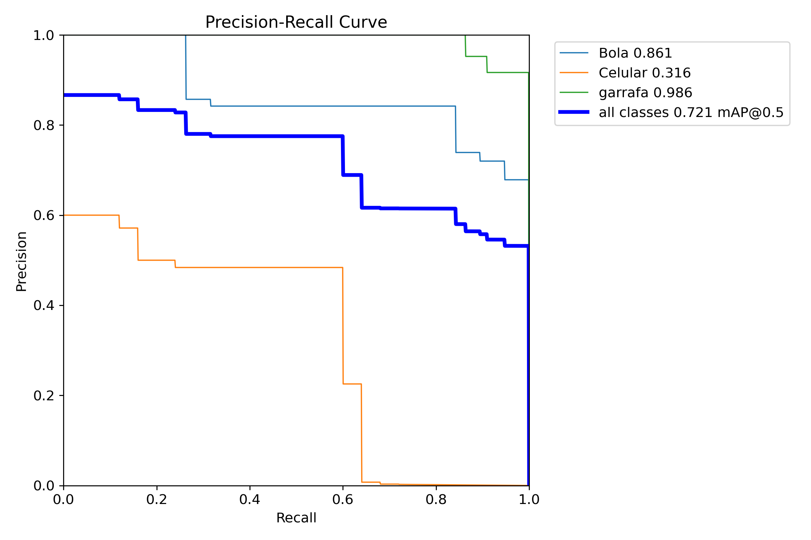
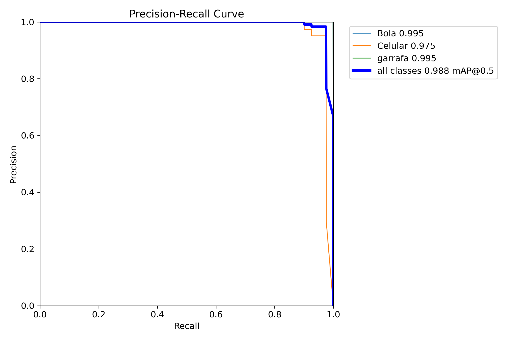

# 🎯 Custom Object Detection with YOLOv8


A real-time object detection project using **YOLOv8 (Ultralytics)** trained on a custom dataset collected via webcam.

Key objectives:

- Build and annotate a custom dataset
- Train different YOLOv8 architecture variants
- Benchmark performance across model versions
- Analyze the impact of data augmentation and dataset expansion
- Perform low-latency real-time inference via webcam

---

## 📦 Detected Classes

- Ball (`Bola`)
- Cellphone (`Celular`)
- Bottle (`Garrafa`)

---

## 📂 Dataset

The dataset was collected, labeled, and managed using **Roboflow**.

🔗 Access link:  
https://universe.roboflow.com/testando-yolo/my-first-project-8szjb/dataset/2

- **Export Format:** YOLOv8  
- **Number of Classes:** 3  
- **Final Dataset Size:** 379 images  
- **Split:** 70% Train / 20% Validation / 10% Test  

---

# 🧠 Methodology

## 1️⃣ Data Collection

- Image capture using a local webcam  
- ~100 initial samples per class  
- Subsequently added +75 images specifically for the **Cellphone** class  
- Bounding box annotations created and verified in Roboflow  

---

## 2️⃣ Trained Models

### 🔹 Model 1 — YOLOv8n (Nano)

- Initial baseline dataset (~303 images)
- Lightweight architecture (~3M parameters)

Validation Results:

| Class | mAP@0.5 |
| :--- | :---: |
| Ball | 0.861 |
| Cellphone | 0.316 |
| Bottle | 0.986 |
| **All** | **0.721** |

📉 The **Cellphone** class suffered from low initial performance, highlighting the need for higher sample diversity and feature variation.

#### PR Curve — YOLOv8n



---

### 🔹 Model 2 — YOLOv8s (Small)

- Augmented dataset (379 images)
- Higher capacity architecture (~11M parameters)

Validation Results:

| Class | mAP@0.5 |
| :--- | :---: |
| Ball | 0.995 |
| Cellphone | 0.975 |
| Bottle | 0.995 |
| **All** | **0.988** |

📈 Combining targeted data augmentation with a higher-capacity model produced a substantial performance leap for the Cellphone class.

#### PR Curve — YOLOv8s



---

# 📊 Results & Comparative Analysis

## General Benchmark

| Model | Dataset | mAP@0.5 (All) |
| :--- | :--- | :---: |
| **YOLOv8n** | Initial dataset (~303 imgs) | 0.713 |
| **YOLOv8s** | Augmented dataset (379 imgs) | **0.988** |

## Key Insights

- The Cellphone class required greater visual diversity (angles, reflections, backgrounds).
- Targeted dataset expansion directly improved both Precision and Recall curves.
- YOLOv8s demonstrated superior generalization on complex bounding patterns.
- Per-class mAP analysis proved essential for diagnosing performance bottlenecks.
- Data curation and quantity were more impactful than model scaling alone.

---

# ⚙️ Training

Model training executed on GPU via CUDA acceleration:

```python
from ultralytics import YOLO

# Load pre-trained weights
model = YOLO("yolov8s.pt")

# Train the model
model.train(
    data="dataset/data.yaml",
    epochs=50,
    imgsz=640,
    device=0
)
